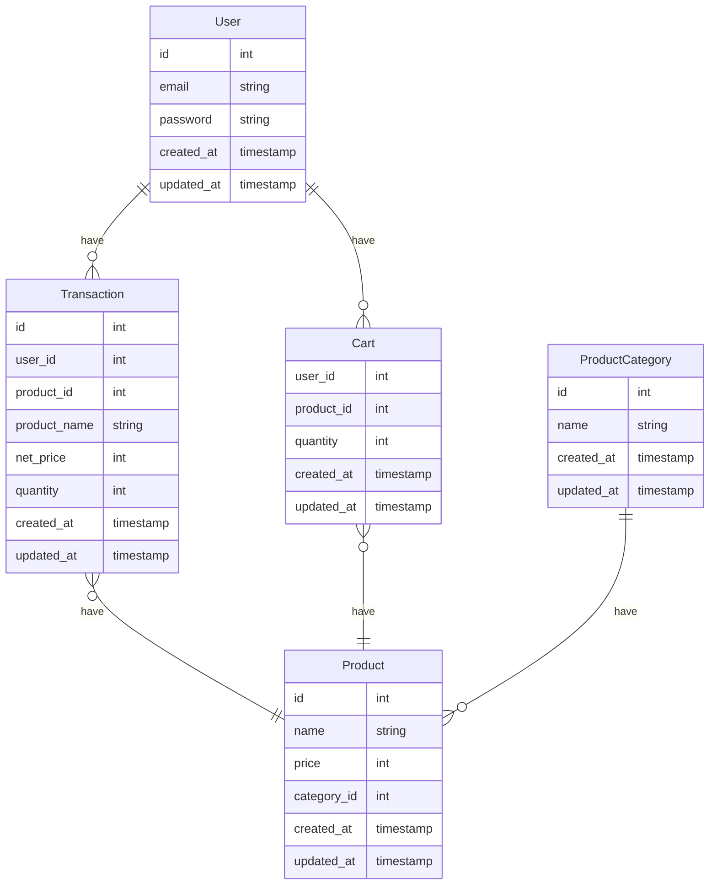

# Synapsis Backend Challenge

## Table of Contents

- [Synapsis Backend Challenge](#synapsis-backend-challenge)
  - [Table of Contents](#table-of-contents)
  - [Challenge](#challenge)
  - [MVP Creteria](#mvp-creteria)
  - [Assessment Criteria](#assessment-criteria)
  - [Entity Relationship Diagram (ERD)](#entity-relationship-diagram-erd)
  - [API Doc](#api-doc)
  - [How to run application](#how-to-run-application)

## Challenge

As a BackEnd Engineer you are required to create an online store application, you don't need to create a FrontEnd but focus on the BackEnd (RESTful API) only. The programming language you must use is Go-lang or Java spring boot.
You can develop your app by starting with prioritized features first. The following are the priority features to meet the MVP (minimum viable product).

## MVP Creteria

- [x] Customer can view product list by product category
- [x] Customer can add product to shopping cart
- [x] Customers can see a list of products that have been added to the shopping cart
- [x] Customer can delete product list in shopping cart
- [x] Customers can checkout and make payment transactions
- [x] Login and register customers

## Assessment Criteria

1. System Design
   - [x] Good README Documentation.
   - [x] RESTful API Design.
   - [x] Entity Relationship Diagram.

2. Backend Development
   - [x] RESTful API.
   - [x] Database Implementation.
   - [x] Commit message.
   - [x] Using cache like redis is a plus.

3. Deployment
   - [x] Dockerfile and docker-compose file.
   - [x] Upload docker image to docker registry (docker hub).
   - [ ] Deploy app to heroku, AWS or GCP.

## Entity Relationship Diagram (ERD)



## API Doc

Online: https://sayyid-haidar.github.io/synapsis-backend-challenge-apidoc/

After running: http://localhost:8080/swagger-ui/index.html

## How to run application

Run with local env:

```bash
mvn clean install

mvn spring-boot:run
```

Run with docker:

```bash
docker compose up
```
