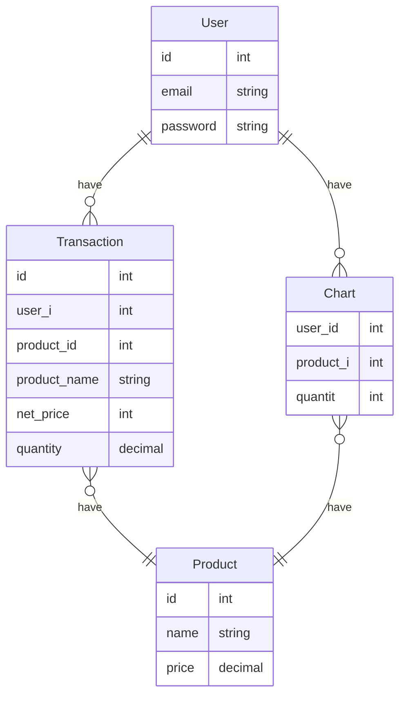

# Synapsis Backend Challenge

## Challenge

As a BackEnd Engineer you are required to create an online store application, you don't need to create a FrontEnd but focus on the BackEnd (RESTful API) only. The programming language you must use is Go-lang or Java spring boot.
You can develop your app by starting with prioritized features first. The following are the priority features to meet the MVP (minimum viable product).

## MVP creteria

- [ ] Customer can view product list by product category
- [ ] Customer can add product to shopping cart
- [ ] Customers can see a list of products that have been added to the shopping cart
- [ ] Customer can delete product list in shopping cart
- [ ] Customers can checkout and make payment transactions
- [ ] Login and register customers

## Assessment Criteria

1. System Design
   - [ ] Good README Documentation.
   - [ ] RESTful API Design.
   - [x] Entity Relationship Diagram.

2. Backend Development
   - [ ] RESTful API.
   - [ ] Database Implementation.
   - [ ] Commit message.
   - [ ] Using cache like redis is a plus.

3. Deployment
   - [ ] Dockerfile and docker-compose file.
   - [ ] Upload docker image to docker registry (docker hub).
   - [ ] Deploy app to heroku, AWS or GCP.

## Entity Relationship Diagram (ERD)

